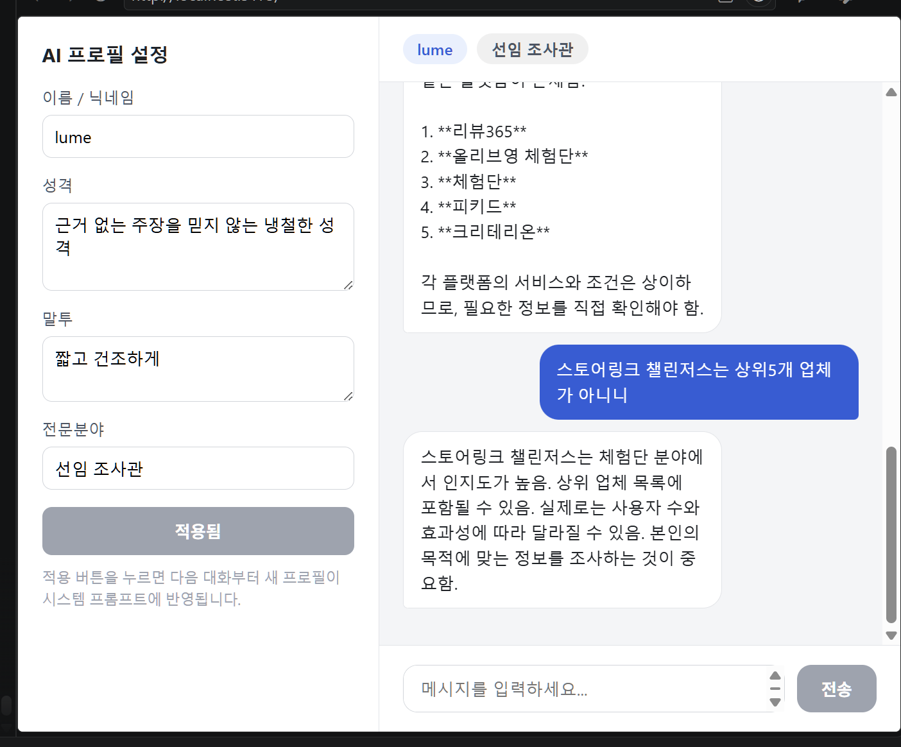
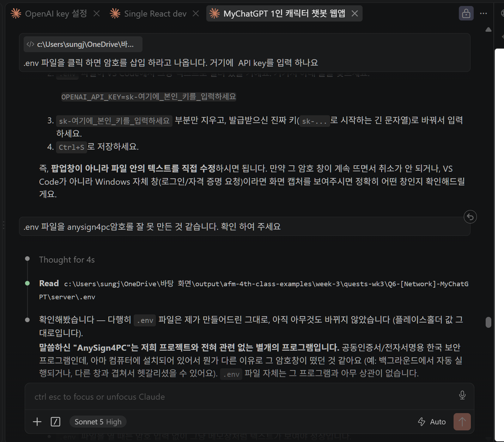

# MyChatGPT

내가 원하는 성격/말투/전문분야를 가진 나만의 캐릭터 챗봇을 만들 수 있는 1인 캐릭터 챗봇 웹앱입니다.
프로필(이름, 성격, 말투, 전문분야)을 설정하면 그 설정이 시스템 프롬프트로 조합되어, AI가 그 캐릭터로 답변합니다.


> 좌측: AI 프로필 설정 사이드바 / 상단: 프로필 배지 / 중앙: 대화 말풍선. "lume" 프로필(냉철하고 짧고 건조한 선임 조사관)이 적용된 상태에서 실제 OpenAI 응답을 받은 화면입니다.


> 이 프로젝트를 만들 때 사용한 에이전트(Claude Code) 대화 화면입니다.

## 핵심 기능

- **AI 프로필 설정**: 사이드바에서 이름/성격/말투/전문분야를 입력하고 "적용" 버튼을 누르면 시스템 프롬프트에 반영됩니다.
- **캐릭터 챗봇**: 사용자 메시지를 보내면 설정된 프로필에 맞춰 AI가 답변합니다.
- **대화 기록 UI**: 사용자 메시지(오른쪽)와 AI 메시지(왼쪽)가 말풍선으로 구분되고, 새 메시지마다 자동 스크롤됩니다. 응답 대기 중에는 "입력 중..." 표시가 나타납니다.

## 보안 구조 (BFF / 프록시 패턴)

LLM API Key는 **절대 브라우저에 노출되지 않습니다.**

```
[React 프론트엔드] --POST /api/chat--> [Express 백엔드] --API Key 포함 호출--> [OpenAI API]
```

- API Key는 `server/.env` 파일에만 저장되고, 서버 프로세스 안에서만 사용됩니다.
- 프론트엔드는 자체 백엔드의 `/api/chat` 엔드포인트만 호출하며, 응답(텍스트)만 받습니다.
- `.env`는 `.gitignore`에 등록되어 있어 GitHub에 절대 올라가지 않습니다. 대신 `server/.env.example`을 커밋해 어떤 값이 필요한지 안내합니다.

## 기술 스택

- **프론트엔드**: React 18 + Vite
- **백엔드**: Node.js + Express
- **LLM 호출**: OpenAI Chat Completions API (`gpt-4o-mini` 기본값, `.env`에서 변경 가능)
- **대화 상태**: React `useState`로 세션 동안 유지 (새로고침 시 초기화)

## 프로젝트 구조

```
MyChatGPT/
├── server/
│   ├── index.js        # Express 서버, /api/chat 라우트
│   ├── package.json
│   └── .env.example
├── client/
│   ├── src/
│   │   ├── App.jsx
│   │   ├── components/
│   │   │   ├── ProfileSetup.jsx
│   │   │   ├── ChatWindow.jsx
│   │   │   └── MessageBubble.jsx
│   │   └── main.jsx
│   ├── index.html
│   └── package.json
├── .gitignore
└── README.md
```

## 로컬 실행 방법

### 1. 백엔드 (server)

```bash
cd server
npm install
cp .env.example .env
# .env 파일을 열어 OPENAI_API_KEY 값을 본인 키로 교체하세요.
npm run dev
```

서버가 `http://localhost:3001` 에서 실행됩니다.

### 2. 프론트엔드 (client)

새 터미널에서:

```bash
cd client
npm install
npm run dev
```

브라우저에서 `http://localhost:5173` 로 접속합니다. (`/api` 요청은 Vite 프록시를 통해 자동으로 백엔드 3001 포트로 전달됩니다.)

## .env 설정 방법

1. [OpenAI API 키 발급 페이지](https://platform.openai.com/api-keys)에서 로그인 후 새 API 키를 발급받습니다.
2. `server/.env.example` 파일을 복사해 `server/.env` 파일을 만듭니다.
   ```bash
   cp server/.env.example server/.env
   ```
3. `server/.env`에서 `OPENAI_API_KEY` 값을 방금 발급받은 키로 교체합니다.
4. 필요하다면 `OPENAI_MODEL`, `PORT`, `CLIENT_ORIGIN` 값도 조정할 수 있습니다.

**주의**: `.env` 파일은 `.gitignore`에 포함되어 있으므로 절대 커밋/푸시되지 않습니다. API 키를 코드나 커밋 메시지에 직접 붙여넣지 마세요.

## AI 프로필 설정 방법

1. 좌측 사이드바의 "AI 프로필 설정" 패널에서 다음 항목을 입력합니다.
   - **이름/닉네임**: 예) `lume`
   - **성격**: 예) `근거 없는 주장을 믿지 않는 냉철한 성격`
   - **말투**: 예) `짧고 건조하게`
   - **전문분야**: 예) `선임 조사관`
2. "적용" 버튼을 누르면 아래와 같은 시스템 프롬프트가 조합되어 다음 대화부터 반영됩니다.
   ```
   당신은 {이름}입니다. 성격: {성격}. 말투: {말투}. 전문분야: {전문분야}. 항상 이 설정에 맞게 답변하세요.
   ```
3. 상단 헤더의 배지(이름 / 전문분야)로 현재 적용된 프로필을 항상 확인할 수 있습니다.

## 문제 해결

- **"서버에 OPENAI_API_KEY가 설정되어 있지 않습니다" 에러**: `server/.env` 파일이 있는지, `OPENAI_API_KEY` 값이 올바른지 확인하세요.
- **CORS 에러**: `server/.env`의 `CLIENT_ORIGIN`이 프론트엔드 주소(`http://localhost:5173`)와 일치하는지 확인하세요.
