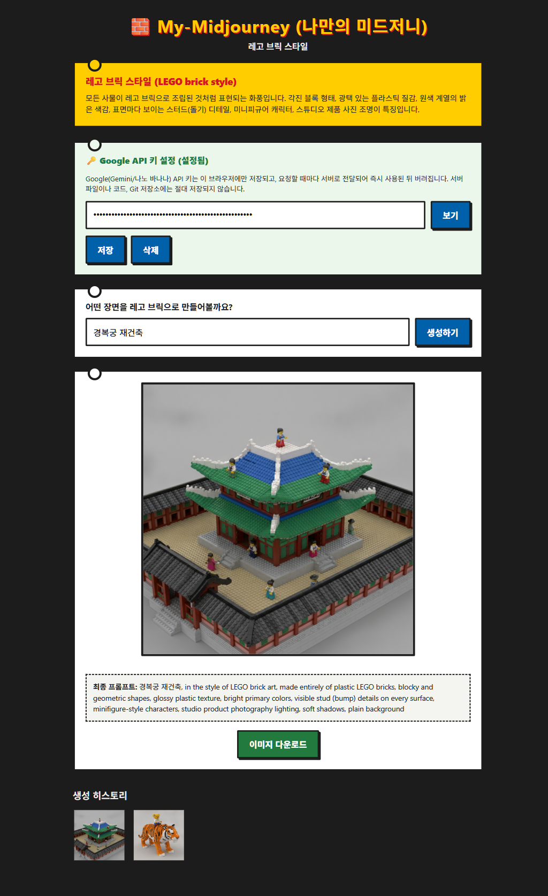
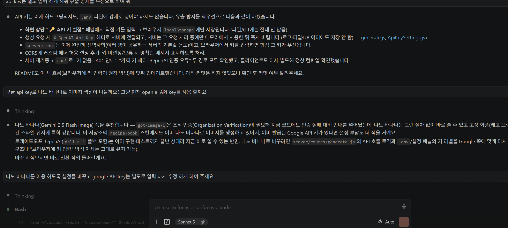

# My-Midjourney (나만의 미드저니)

텍스트 프롬프트를 입력하면 **고정된 화풍("레고 브릭 스타일")**이 자동으로 결합되어,
AI 이미지 생성 API로 네트워크 요청을 보내고 결과 이미지를 화면에 보여주는 1인 이미지 생성 웹앱입니다.


> 스크린샷 삽입 자리: 프롬프트 입력 → 로딩 → 결과 이미지가 표시된 화면을 캡처해서 넣어주세요.


> 스크린샷 삽입 자리: 이 프로젝트를 만들 때 사용한 에이전트(Claude Code 등) 대화 화면을 캡처해서 넣어주세요.

## 고정 스타일: 레고 브릭 스타일 (LEGO brick style)

사용자가 입력창에 무엇을 넣든, 서버가 항상 아래 접미사를 자동으로 덧붙여 최종 프롬프트를 만듭니다.

```
in the style of LEGO brick art, made entirely of plastic LEGO bricks,
blocky and geometric shapes, glossy plastic texture,
bright primary colors, visible stud (bump) details on every surface,
minifigure-style characters, studio product photography lighting,
soft shadows, plain background
```

- 모든 사물이 레고 브릭으로 조립된 것처럼 표현됩니다.
- 각진 블록 형태, 광택 있는 플라스틱 질감, 원색 계열의 밝은 색감이 특징입니다.
- 스타일은 `server/constants/styles.js`(실제 API 호출 기준)와 `client/src/constants/styles.js`(화면 표시용)에
  상수로 정의되어 있어, 다른 화풍으로 바꾸고 싶으면 이 두 파일의 `promptSuffix`/`description`만 교체하면 됩니다.

## 보안 구조 (BFF / 프록시 패턴 + 브라우저 API 키 입력)

**API 키 유출 방지를 최우선으로 설계했습니다.**

```
[React 프론트엔드] --POST /api/generate (헤더에 키 포함)--> [Express 백엔드] --API Key 포함 호출--> [Google Gemini(나노 바나나) API]
```

- 이미지 생성 API 키는 **코드에 하드코딩하지 않고**, 화면 상단 "API 키 설정" 패널에서 직접 입력합니다.
- 입력한 키는 이 브라우저의 `localStorage`에만 저장됩니다. `.env` 파일, 서버 디스크, Git 저장소
  어디에도 저장되지 않습니다.
- 요청할 때마다 `X-Google-Api-Key` 헤더로 서버에 전달되고, 서버는 그 요청을 처리하는 동안만
  메모리에서 사용한 뒤 즉시 버립니다(로그/파일/DB에 남기지 않음).
- 최종 프롬프트(사용자 입력 + 고정 스타일)는 **서버**에서 조합됩니다. 클라이언트가 요청을 조작해도
  서버가 항상 고정 스타일을 다시 덧붙이기 때문에 화풍이 임의로 바뀌지 않습니다.
- (선택) 여러 명이 같은 서버를 쓰는 강의실 환경 등에서는 `server/.env`에 `GOOGLE_API_KEY`를 넣어
  서버 쪽 기본값으로 쓸 수도 있습니다. 브라우저에서 키를 입력하면 그 키가 항상 우선 적용됩니다.
  `.env`는 `.gitignore`에 등록되어 있어 GitHub에 절대 올라가지 않습니다. 대신 `server/.env.example`을
  커밋해 어떤 값이 필요한지 안내합니다.

## 기술 스택

- **프론트엔드**: React 18 + Vite
- **백엔드**: Node.js + Express (API 프록시 서버, Node 내장 `fetch` 사용)
- **이미지 생성 API**: [Google Gemini API](https://ai.google.dev/gemini-api/docs/image-generation) —
  나노 바나나(`gemini-2.5-flash-image`) 모델. 실패 시 `gemini-2.5-flash-image-preview`로 자동 재시도합니다.

## 프로젝트 구조

```
Q7-[Network]-My-Midjourney/
├── client/                          # 프론트엔드
│   ├── src/
│   │   ├── App.jsx
│   │   ├── App.css
│   │   ├── constants/styles.js      # 고정 화풍 프롬프트 정의 (화면 표시용)
│   │   └── components/
│   │       ├── ApiKeySettings.jsx   # API 키 입력/저장(localStorage) 패널
│   │       ├── PromptForm.jsx       # 프롬프트 입력창 + 생성하기 버튼
│   │       ├── ResultImage.jsx      # 결과 이미지 + 최종 프롬프트 + 다운로드 버튼
│   │       └── HistoryGrid.jsx      # 생성 히스토리 썸네일 목록
│   └── package.json
├── server/                          # 백엔드 (API 프록시)
│   ├── index.js
│   ├── routes/generate.js           # POST /api/generate
│   ├── constants/styles.js          # 고정 화풍 프롬프트 정의 (실제 API 호출 기준)
│   ├── .env.example
│   └── package.json
├── .gitignore
└── README.md
```

## 로컬 실행 방법

### 1. 백엔드 (server)

```bash
cd server
npm install
npm run dev
```

서버가 `http://localhost:3002` 에서 실행됩니다. (`.env` 설정 없이 바로 실행해도 됩니다 — API 키는
브라우저에서 입력합니다.)

### 2. 프론트엔드 (client)

새 터미널에서:

```bash
cd client
npm install
npm run dev
```

브라우저에서 `http://localhost:5174` 로 접속합니다. (`/api` 요청은 Vite 프록시를 통해 자동으로
백엔드 3002 포트로 전달됩니다.)

### 3. API 키 입력

1. 화면 상단의 "🔑 Google API 키 설정" 패널을 펼칩니다.
2. 발급받은 Google API 키를 입력하고 "저장"을 누릅니다. (아래 발급 방법 참고)
3. 이제 "생성하기"를 누르면 이 키로 이미지가 생성됩니다. 키는 이 브라우저에만 남고, 지우고
   싶으면 같은 패널에서 "삭제"를 누르면 됩니다.

## 이미지 생성 API 발급 방법

1. [Google AI Studio API 키 발급 페이지](https://aistudio.google.com/apikey)에서 로그인 후 새 API 키를
   발급받습니다. (별도 조직 인증 절차 없이 바로 발급됩니다.)
2. 발급받은 키는 **파일에 저장하지 말고** 위 "API 키 입력" 단계처럼 화면의 "API 키 설정" 패널에
   붙여넣으세요. 이 방식이 `.env` 파일에 넣는 것보다 유출 위험이 낮습니다(디스크/Git에 전혀 남지 않음).

**주의**: API 키를 코드, 커밋 메시지, `.env` 등 어떤 파일에도 직접 붙여넣지 마세요.
`server/.env`를 굳이 쓰더라도 `.gitignore`에 포함되어 있어 커밋되지는 않지만, 브라우저 입력 방식이
더 안전합니다.

## 사용 방법

1. 화면 상단 "API 키 설정" 패널에 Google API 키를 입력하고 저장합니다.
2. 입력창에 원하는 장면을 자유롭게 입력합니다. (예: "우주비행사가 달에서 커피를 마시는 모습")
3. "생성하기" 버튼을 누르면 입력값 검증 → 로딩 표시 → 서버 요청 순서로 진행됩니다.
4. 서버가 사용자 입력 뒤에 고정 스타일(레고 브릭 스타일) 프롬프트를 붙여, 브라우저가 보낸 키로
   Gemini(나노 바나나) 이미지 생성 API를 호출합니다.
5. 생성이 완료되면 이미지와 함께 실제 사용된 최종 프롬프트가 표시됩니다.
6. 이미지 아래 "이미지 다운로드" 버튼으로 결과물을 저장할 수 있고, 생성한 이미지들은 하단
   히스토리 썸네일 목록에 계속 쌓입니다. 썸네일을 클릭하면 해당 이미지를 다시 크게 볼 수 있습니다.

## 에러 처리

- 빈 프롬프트로 제출하면 "프롬프트를 입력해주세요." 경고가 표시되고 요청이 전송되지 않습니다.
- API 키를 입력하지 않고 생성을 시도하면 "Google API 키가 설정되어 있지 않습니다. ... API 키 설정
  패널에서 키를 입력해주세요." 메시지가 표시됩니다.
- 백엔드 서버가 꺼져 있으면 "서버에 연결할 수 없습니다. 백엔드 서버가 실행 중인지 확인해주세요." 메시지가 표시됩니다.
- Gemini API 호출 자체가 실패하면(키가 잘못됨, 요금 한도 초과 등) "이미지 생성 중 오류가 발생했습니다." 메시지가 표시됩니다.

## 문제 해결

- **"Google API 키가 설정되어 있지 않습니다" 오류**: 화면 상단 "API 키 설정" 패널에 키를 입력하고
  저장했는지 확인하세요.
- **모델 인증/권한 오류**: 발급받은 키가 Gemini API(생성형 언어 API)에 대한 접근 권한이 있는지
  [Google AI Studio](https://aistudio.google.com/apikey)에서 확인하세요.
- **CORS 에러**: `server/.env`의 `CLIENT_ORIGIN`이 프론트엔드 주소(`http://localhost:5174`)와 일치하는지 확인하세요.
- **이미지가 안 뜨는 경우**: 브라우저 개발자도구 Network 탭에서 `/api/generate` 요청/응답을 확인하세요.

## GitHub 저장소

https://github.com/hsungjai-create/afm-4th-class-examples
